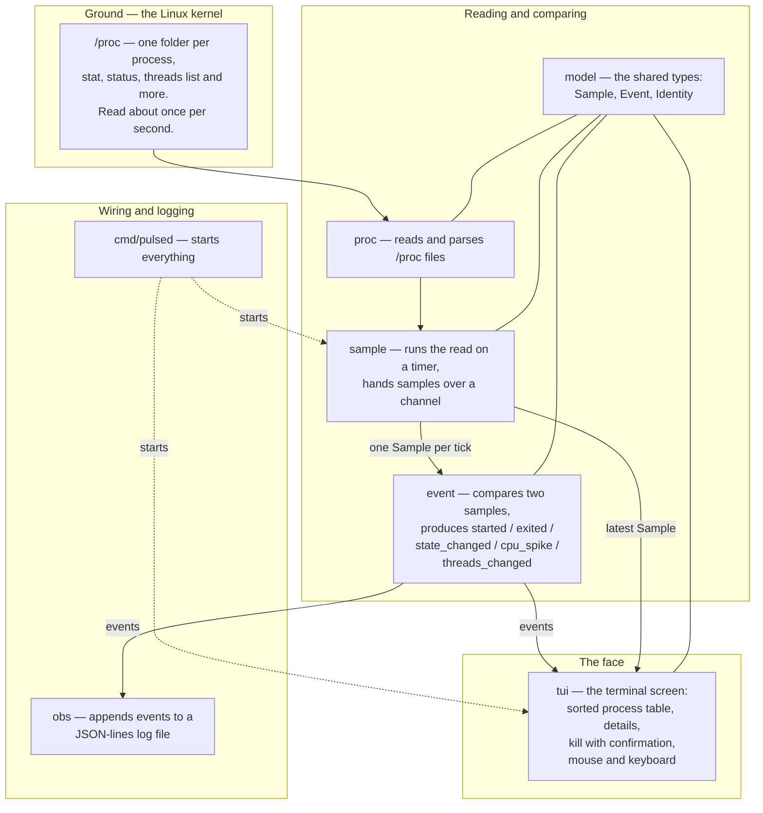

# Pulsed

Pulsed is a Linux process monitor, written in Go. It reads what the kernel says about every running process. It finds what changed since the last read. It writes the changes to a log and shows everything on one terminal screen.

The kernel keeps a folder for each running process under `/proc`. Pulsed reads those folders about once per second.

## Status

Pre-alpha. Linux only.

- **Today:** one function that lists process numbers. Nothing runs yet.
- **Everything below is planned.** A feature leaves "planned" only after a test passes and someone has seen it work.

## Why Pulsed

- **Changes, not just a snapshot.** Pulsed compares each read to the one before. It records what changed: a process started, exited, changed state, spiked in CPU use, or changed its thread count.
- **A true identity for each process.** The kernel reuses process numbers. Pulsed plans to tell processes apart by number plus start time. This idea is not tested yet.
- **A log you can search.** Events go to a JSON-lines file, one event per line.
- **One screen.** A sorted process table, a detail view, resource limits, and an event timeline. Click, scroll, drag, or use the keyboard. The screen resizes with your terminal. You can kill your own processes after a confirmation.
- **Built to learn.** An educational project built to understand how linux internal systems work.

## How it works



Read it from the top. The kernel exposes `/proc`. `proc` reads it. `sample` repeats the read on a timer. `event` compares two samples. `obs` writes the log. `tui` draws the screen. `model` holds the types they share.

- The core uses only the Go standard library.
- The screen uses [Bubble Tea](https://github.com/charmbracelet/bubbletea).
- Pulsed needs no root.

### The screen (planned)

```
     1        2        3        4
  ┌──────────────────────────────────┐
  │ A PROCESS TREE   │ B DETAIL      │
  │                  │               │
  ├──────────────────┴───────────────┤
  │ D PROCESS LIST                   │
  │                                  │
  ├────────────────┬─────────────────┤
  │ E LIMITS       │ F EVENT LOG     │
  ├────────────────┴─────────────────┤
  │ TITLE: Pulsed  host  kernel  #42 │
  └──────────────────────────────────┘
```

Each panel has a letter, and the frame has coordinates, like an engineering drawing sheet. The colors are Catppuccin Mocha.

## Open source

Pulsed is free software under MIT. See `LICENSE`.

## Build from source

Prerequisites: Linux and Go. The Go version is in `go.mod`.

```
go test ./...
```

There is nothing to run yet. The program entry point, `cmd/pulsed`, does not exist.

## Development & verification

`AGENTS.md` is the contributor guide. It sets the rules for people and AI tools. It says which code the owner writes by hand, which code a tool may build, and how work is checked.

The short loop:

```
gofmt -s -l .
go vet ./...
go test ./...
```

`gofmt` prints nothing when the code is formatted. The command `python3 learning/check.py` reports overdue items in the project's learning log.

## Contributing

Pulsed is pre-alpha and a learning project. The owner writes `internal/proc`, `internal/model`, `internal/sample`, and `internal/event` by hand. Pull requests that change those folders are unlikely to be merged.

Bug reports, ideas, and docs fixes are welcome. For larger changes, please open an issue first. Read `AGENTS.md` before you start.