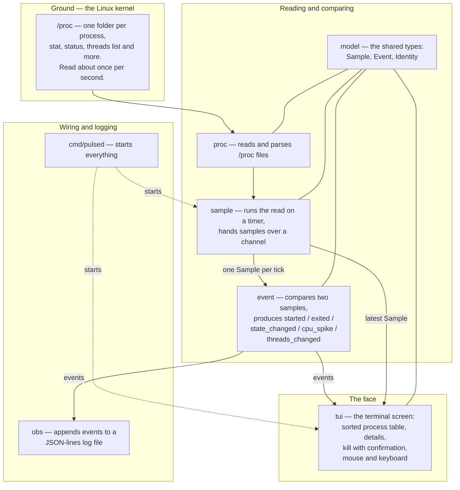

# Pulsed system diagram

Pulsed is a Linux program that watches processes. It reads files the kernel
already keeps about every running process, notices what changed, writes those
changes to a log file, and shows a live table in the terminal.

This diagram reads from the bottom up: the kernel is the ground, the face is
what the user sees.

Three things to notice:

1. Data flows one way. Kernel → proc → sample → event → log and screen.
2. `model` sits under everything. It holds the types all parts agree on,
   so no part needs to know how another part works.
3. Each box is a separate Go package. Only the starter program talks to
   all of them; everything else talks to as few neighbors as possible.

Build order is incremental: ListPIDs first, then reading one process,
parsing, CPU percentage, timer + channel, events, log, table, kill.
The screen comes after the data path works.
